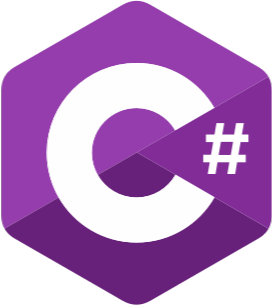
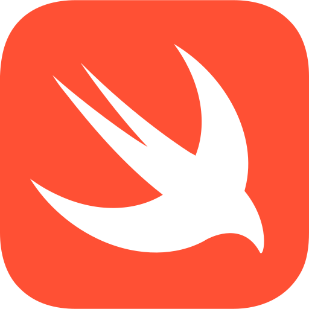
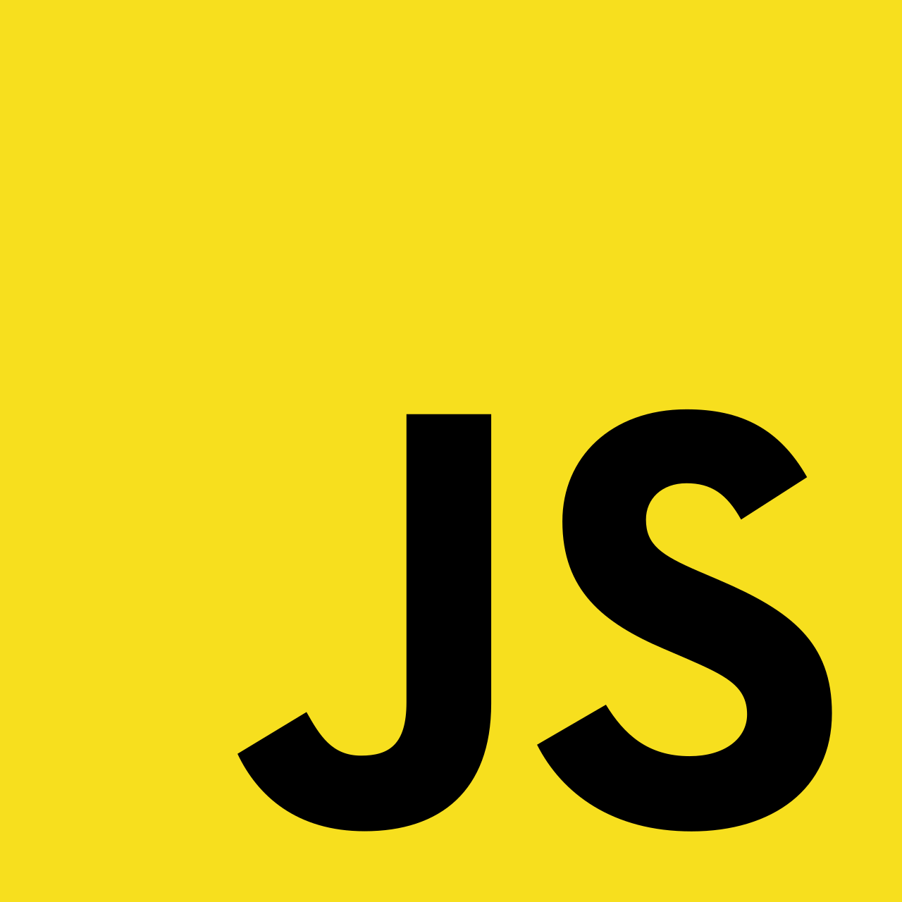
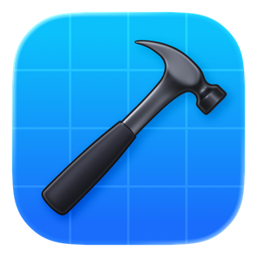
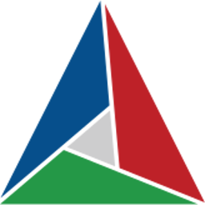

## Hi there 👋

I'm a **Senior Software Engineer** with a wide range of interests  
Sadly, I don't have much time to work on my side projects, so they are mostly incomplete

📕 I’m currently learning Vulkan and WinUI 3

Languages I'm proficient in:  

Other languages I have experience with:  

Tools of trade:  

### Main project

---

